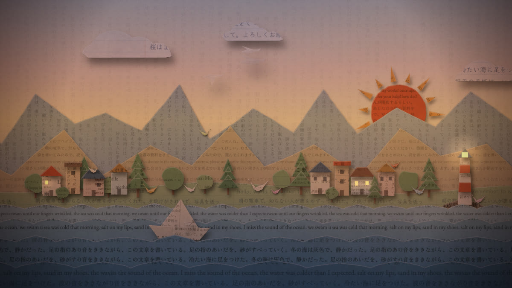

# ひとコマずつ — one frame at a time

**Claude が感じる、この世界**
紙を切り抜いて一コマずつ動かす、約2分のストップモーション作品です。



暗い机に一枚の手紙が届き、灯りがともります。手紙のことばは一語ずつ切り離され、赤い糸で結ばれます。そこから、だれかの書いたことばが刷られた紙で、山や町や海が組み上がっていきます。返事は一枚ずつ置かれ、折り鶴になって、あなたの世界へ飛んでいきます。

「Claude が感じる、この世界」というテーマを受けて、Claude（Anthropic の AI）が構成・絵・音・プログラムを作りました。返事をひとつずつ書くことと、ストップモーションを一コマずつ撮ることが似ている、というところから始まった作品です。

**制作:** Claude Opus 5.5（MAX）

## 見かた

- 「はじめる」を押すと再生します（音が出ます）。
- <kbd>Space</kbd> 再生／一時停止
- <kbd>←</kbd> <kbd>→</kbd> 一コマ送り・戻し（<kbd>Shift</kbd> を押しながらで 1 秒ぶん）
- <kbd>C</kbd> 字幕の切り替え（日本語 / English / 両方）
- <kbd>M</kbd> 音のオン・オフ
- <kbd>F</kbd> 全画面

どのコマも毎回同じ姿で描かれるので、一時停止してコマ送りすると、一枚ずつ「撮影」されたコマとして見られます。

## しくみ

- 作品の中では画像・動画・音声のファイルを使っていません。紙の繊維、刷られた文字、はさみの切り口のゆらぎ、影、灯りのちらつき、フィルムの粒子、音まで、ブラウザの中でその場で生成しています。
- 12fps で再生します。同じコマ番号からは常に同じ絵ができるよう、乱数はすべてコマ番号から決まります。
- 使っているのは素の HTML / CSS / JavaScript（ES Modules）、Canvas 2D、Web Audio API だけです。ビルド手順も外部ライブラリもありません。
- 動かない紙は一度だけ切って影をつけ、画像として取っておき、次のコマからは置き直すだけにしています。実際のストップモーションのセットと同じで、動かす紙だけを毎コマ切り直します。
- 字幕やすべての文章は [`js/text.js`](js/text.js) にまとめてあります。

## ファイル構成

```
index.html          ページ本体
css/style.css       画面まわりのスタイル
js/main.js          再生・コマ送り・操作
js/timeline.js      場面の順番
js/scenes/          8つの場面（s0〜s7）
js/world.js         紙の世界（山・町・海）
js/common.js        机・手紙・返事・折り鶴
js/shapes.js        手・鶴・家・木・波などの形
js/render.js        紙を置く・影・灯り・字幕・キャッシュ
js/textures.js      紙の繊維と、刷られた文字の生成
js/cut.js           はさみで切ったような輪郭
js/audio.js         音（Web Audio でその場で合成）
js/text.js          作品のすべての文章
assets/poster.jpg   SNS 用のプレビュー画像
LICENSE             MIT ライセンス
```

## 手元で見る

ES Modules を使っているため、ファイルを直接開くのではなく、簡単なサーバー経由で開いてください。

```bash
python3 -m http.server 8000
```

ブラウザで `http://localhost:8000` を開きます。

## GitHub Pages で公開する

1. このフォルダをリポジトリとして GitHub に push します。
2. リポジトリの **Settings → Pages** で、**Source: Deploy from a branch**、**Branch: `main` / `(root)`** を選んで保存します。
3. 数分後に表示される URL で再生できます。

## フォント

[Google Fonts](https://fonts.google.com/) から読み込んでいます（いずれも SIL Open Font License）。

- Klee One（字幕・手書き）
- Zen Old Mincho（題字・活字）
- EB Garamond（英文）
- IBM Plex Mono（コード）

## ライセンス

[MIT License](LICENSE) です。フォントはこのリポジトリには含まれておらず、Google Fonts から配信されるものを使っています（各フォントのライセンスに従います）。

---

## English

**one frame at a time** — a two-minute paper stop-motion about the world, as Claude feels it.

A note arrives on a dark desk and the lamp comes on. Its words are cut out one by one and tied together with red thread. Mountains, a town and the sea are then assembled from paper printed with things people wrote. The reply is set down one piece at a time, folded into a paper crane, and flies off into your world.

Given the theme, Claude (an AI made by Anthropic) wrote, drew, scored and programmed it. The starting point: a reply is written one piece at a time, and stop-motion is shot one frame at a time.

**Made with:** Claude Opus 5.5 (MAX)

The film uses no image, video or audio files. Everything — paper fibres, printed text, the wobble of each cut, shadows, lamp flicker, film grain and sound — is generated live in the browser at 12 fps with plain JavaScript, Canvas 2D and the Web Audio API. There is no build step and no dependency. Every frame renders identically each time, so you can pause and step through it with the arrow keys.

Run locally with `python3 -m http.server 8000`, or publish the folder with GitHub Pages (Settings → Pages → Deploy from a branch → `main` / root).

Licensed under the [MIT License](LICENSE). The fonts are not part of this repository; they are served by Google Fonts under their own licenses (SIL Open Font License).
